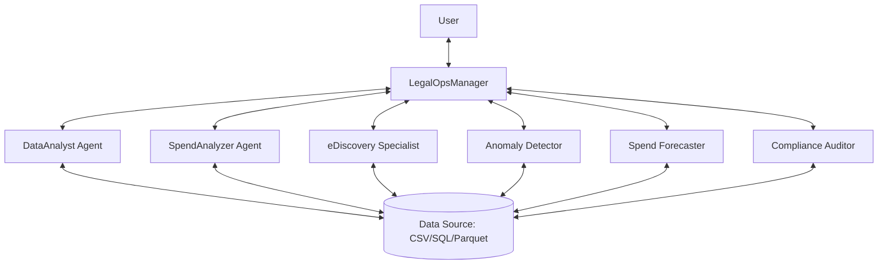

# Legal Spend Main - Hierarchical Agent System

A comprehensive, AI-powered legal spend analysis platform built with Google's Agent Development Kit (ADK) and Ollama. This application features a **hierarchical agent system** where a manager agent orchestrates six specialized sub-agents to provide deep insights into legal data from CSV, Parquet, and SQL Server sources.

## 🚀 System Architecture

The application uses a "Manager-Worker" architecture pattern. The **LegalOpsManager** acts as the interface and orchestrator, delegating tasks to specialized agents based on the user's intent.



### The Agents

| Agent | Role | Key Capabilities |
|-------|------|------------------|
| **LegalOpsManager** | **Orchestrator** | Routes queries, synthesizes responses, manages context. |
| **DataAnalyst** | **Data Engineering** | Validates data, checks schema quality, provides statistical summaries, handles SQL queries. |
| **SpendAnalyzer** | **Financial Analysis** | Calculates firm totals, identifies cost-saving opportunities, analyzes spending trends. |
| **eDiscoverySpecialist** | **Domain Expert** | Analyzes document review costs, identifies inefficient staffing (e.g., partners doing review). |
| **AnomalyDetector** | **Risk Management** | Detects statistical outliers in billing, flags unusual invoice patterns. |
| **SpendForecaster** | **Predictive Analytics** | Predicts future spend based on historical trends, assists with budgeting. |
| **ComplianceAuditor** | **Policy Enforcement** | Verifies adherence to billing guidelines, checks rate compliance. |

## ✨ Key Features

- **Multi-Model Support**: Configure different LLMs (via Ollama) for each agent. For example, use a fast model (`mistral`) for simple queries and a reasoning model (`llama2` or `codellama`) for complex analysis.
- **Universal Data Support**:
  - **CSV & Parquet**: Direct file upload and processing.
  - **SQL Server**: Native `pyodbc` integration for connecting to enterprise databases.
- **Interactive UI**: A Streamlit-based interface for:
  - Real-time chat with the agent swarm.
  - Dynamic configuration of agent models.
  - Data source selection and validation.
  - Visual display of analysis results.
- **Extensible Tooling**: Agents are equipped with specific Python tools (e.g., `calculate_firm_totals`, `identify_cost_savings`) wrapped as `FunctionTool`s.

## 🛠️ Prerequisites

Before running the application, ensure you have the following:

1.  **Python 3.8+**: The core runtime.
2.  **Ollama**: For running local LLMs.
    *   Download from [ollama.ai](https://ollama.ai).
    *   Run `ollama serve` to start the API.
    *   Pull models: `ollama pull mistral:7b`, `ollama pull llama2`.
3.  **ODBC Driver 17 for SQL Server** (Optional): Required only if connecting to a SQL Server database.

## 📦 Installation

1.  **Navigate to the project directory**:
    ```bash
    cd legal_spend_main
    ```

2.  **Install Python dependencies**:
    ```bash
    pip install -r requirements.txt
    ```

## 🚀 Usage

### Option 1: Streamlit UI (Recommended)

The web interface provides the full experience with configuration options.

```bash
cd ui
streamlit run app.py
```

*   **URL**: Open `http://localhost:8501` in your browser.
*   **Workflow**:
    1.  Use the **Sidebar** to configure models (optional).
    2.  Select your **Data Source** (Upload CSV/Parquet or connect to SQL).
    3.  **Chat** with the system (e.g., "Analyze our spend").

### Option 2: ADK CLI

Run the agent directly from the command line using the Agent Development Kit runner.

```bash
# From the parent directory
adk run legal_spend_main
```

### Option 3: Python Integration

Embed the agent system into your own Python scripts.

```python
from legal_spend_main.agent import create_legal_ops_manager
from legal_spend_main.shared.data_loader import UniversalDataLoader

# 1. Initialize Agent
agent = create_legal_ops_manager()

# 2. Load Data (example)
loader = UniversalDataLoader()
loader.load_csv("my_data.csv")

# 3. Run (implementation depends on your runner/session logic)
```

## ⚙️ Configuration

### Environment Variables

Create a `.env` file in the root of `legal_spend_main` to persist settings.

| Variable | Description | Default |
|----------|-------------|---------|
| `OLLAMA_BASE_URL` | URL of the Ollama API | `http://localhost:11434` |
| `SQL_DRIVER` | ODBC Driver name | `{ODBC Driver 17 for SQL Server}` |
| `SQL_SERVER` | SQL Server hostname | `localhost` |
| `SQL_DATABASE` | Default database name | `LegalSpend` |
| `SQL_TRUSTED_CONNECTION` | Use Windows Auth (`yes`/`no`) | `yes` |

### Per-Agent Model Configuration

In `config.py` or via the Streamlit UI, you can assign specific models to agents.

```python
AGENT_MODELS = {
    "LegalOpsManager": "mistral:7b",
    "DataAnalyst": "llama2",
    "SpendAnalyzer": "mistral:7b",
    ...
}
```

## 📁 Project Structure

```
legal_spend_main/
├── agent.py                 # ROOT AGENT: Defines LegalOpsManager and sub-agent wiring
├── config.py                # Global configuration and model defaults
├── requirements.txt         # Dependency list
├── agents/                  # SUB-AGENTS definitions
│   ├── data_analyst.py      # Data loading & validation logic
│   ├── spend_analyzer.py    # Financial analysis logic
│   ├── ediscovery_specialist.py
│   ├── anomaly_detector.py
│   ├── spend_forecaster.py
│   └── compliance_auditor.py
├── tools/                   # CAPABILITIES (Tools)
│   ├── analysis_tools.py    # e.g., calculate_firm_totals
│   ├── data_ingestion_tools.py # e.g., ReadCsvTool
│   └── ...
├── data/                    # DATA LAYER
│   ├── sql_connector.py     # SQL Server connection manager
│   ├── storage.py           # Abstract storage handling
│   └── ...
├── prompts/                 # INSTRUCTIONS
│   ├── manager_prompt.py    # System prompt for Manager
│   └── ...
├── ui/                      # FRONTEND
│   ├── app.py               # Streamlit entry point
│   └── components/          # UI Widgets (Chat, Config, etc.)
└── shared/                  # UTILITIES
    └── agent_factory.py     # Helpers for agent creation
```

## 🧪 Testing & Data Format

### Expected Data Schema

The system works best with data containing these columns (names are normalized automatically):
*   `Law Firm` / `Vendor`
*   `Amount` / `Cost` / `Spend`
*   `Date` / `Invoice Date`
*   `Description` / `Narrative`
*   `Timekeeper` / `Name`
*   `Rate` / `Hourly Rate`

### Sample Data Generation

You can generate a test file using Python:

```python
import pandas as pd
df = pd.DataFrame({
    'law_firm': ['Firm A', 'Firm B'],
    'amount': [1000.00, 2500.50],
    'date': ['2024-01-01', '2024-01-02'],
    'description': ['Research', 'Drafting'],
    'rate': [350, 450]
})
df.to_csv('test_spend.csv', index=False)
```

## 🔍 Troubleshooting

*   **"Connection Refused"**: Ensure Ollama is running (`ollama serve`).
*   **"Model Not Found"**: Run `ollama pull <model_name>` for the missing model.
*   **"Driver not found" (SQL)**: Install the ODBC Driver 17 for SQL Server.
*   **"Empty Response"**: The model might be too small (e.g., tinyllama) for complex reasoning. Try `mistral:7b` or `llama2`.

## 🤝 Contributing

1.  Fork the repository.
2.  Create a feature branch.
3.  Add your agent in `agents/` and register it in `agent.py`.
4.  Submit a Pull Request.

---
*Built with Google ADK & Streamlit*
